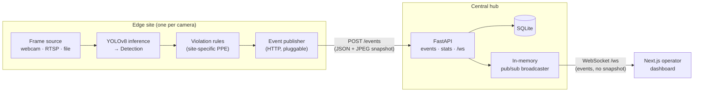
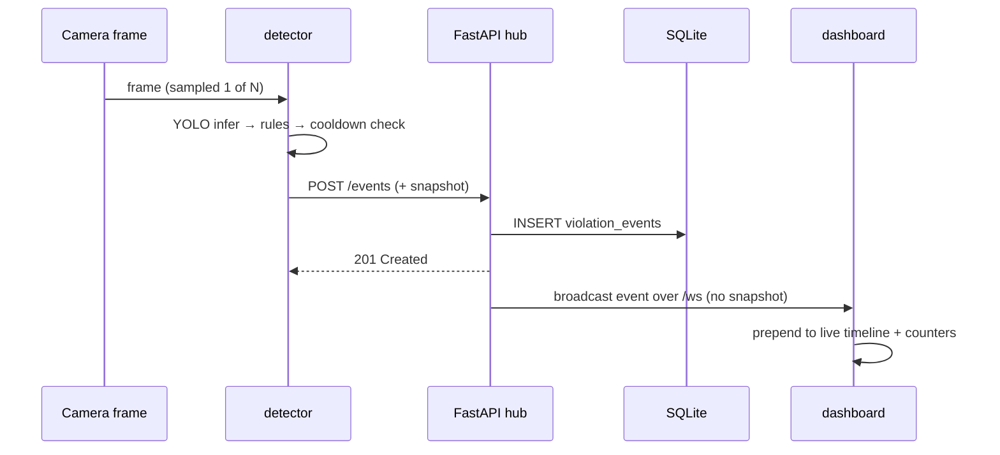

# PPE Watchman

Real-time, edge-to-cloud detection of missing personal protective equipment
(PPE) on industrial camera streams. An edge client runs YOLO inference and
streams lightweight **violation events** to a central FastAPI hub, which
persists them and pushes them over **WebSocket** to a live operator dashboard.


---

## Why this project

Missing hard hats and safety vests are a leading cause of serious injuries on
construction and manufacturing sites. Having a person watch every CCTV feed
around the clock does not scale. A vision model can carry that monitoring load
and alert an operator the moment a violation appears.

I built PPE Watchman to explore the **systems engineering** that such a product
actually requires once you move past a single-script demo: how to split work
between the edge and a central server, keep the network cheap, survive
connectivity loss, aggregate many sites into one view, and stream events to a
browser in real time. The detection model itself is deliberately swappable (see
[What works vs. what's a stub](#what-works-vs-whats-a-stub)) — the contribution
here is the distributed, real-time event pipeline around it.

---

## Architecture



End-to-end flow of a single violation:



---

## Components

| Service | Responsibility | Deployment target |
|---|---|---|
| **detector** | Read frames → YOLO inference → apply site PPE rules → publish violation events | Edge PC / NVIDIA Jetson at the site |
| **api** | Ingest, validate, and persist events; expose REST + WebSocket; aggregate daily stats | On-prem server or cloud |
| **dashboard** | Live violation timeline and per-kind / per-site counters | Control-room browser |

Why three services instead of one:

1. **Bandwidth** — the edge sends a few KB per event instead of a multi-MB/s
   video stream, so many sites can report to one hub over modest links.
2. **Edge autonomy** — if the link to the hub drops, the detector keeps running
   locally and only logs a warning; monitoring does not stop at the site.
3. **Multi-site supervision** — many detectors fan into one API and one
   dashboard, so an operator watches every site from a single screen.

---

## Key design decisions and trade-offs

| Decision | Reasoning | Production extension path |
|---|---|---|
| Isolate `violation_rules.py` | PPE requirements differ by site (construction = helmet; chemical plant = helmet + vest + goggles) | Per-site rule config injected at startup |
| `inference.py` returns a `Detection` value object | The model can be swapped (TensorRT / ONNX) without touching the pipeline | Jetson `l4t` image with a TensorRT engine |
| `EventPublisher` abstraction | Transport (HTTP / MQTT / WebSocket) is hidden from the pipeline | MQTT broker for air-gapped factory networks |
| Frame sampling (process 1 of N frames) | PPE state does not change frame-to-frame, so inference is run ~N× less often | Add temporal smoothing to further cut false positives |
| Per-kind cooldown | One ongoing violation must not spam the API every frame | Track violation duration instead of a fixed window |
| SQLite + in-memory broadcaster | Simple, single-process prototype storage and fan-out | Postgres + Redis pub/sub for multi-worker scale-out |
| WebSocket push (not REST polling) | Events reach the dashboard the instant they occur, with no polling overhead | Same interface, Redis-backed fan-out |
| One Docker image per service | Each tier deploys independently to its target | Kubernetes manifests |

---

## What works vs. what's a stub

This is an honest accounting — the goal is to be clear about where the
engineering is real and where it is intentionally a placeholder.

**Working, end-to-end:**

- The full pipeline runs as three real services and a violation flows
  edge → API → persisted row → WebSocket → dashboard.
- Frame sampling and per-kind cooldown are implemented in `pipeline.py`.
- The API validates input (Pydantic), persists to SQLite, and fans out to all
  connected dashboards via a bounded-queue broadcaster with backpressure
  handling (a slow client is dropped, not allowed to block the broadcast).
- The dashboard renders a live timeline and daily counters from REST +
  WebSocket.
- Test suites cover the pure violation-rules logic (8 tests) and the API —
  ingestion, persistence, input validation (confidence/bbox bounds,
  required fields, query limits), listing/filtering, daily-stats aggregation
  (including the UTC-day boundary), the WebSocket relay handler, and
  broadcaster fan-out / backpressure (25 tests). All pass; see
  [Testing & CI](#testing--ci).

**Intentionally a stub:**

- **Detection model.** The detector loads stock **COCO YOLOv8n** weights, not a
  PPE fine-tuned model. With those weights, `violation_rules.py` runs a
  documented heuristic fallback ("a detected `person` with no helmet/vest class
  in the same frame ⇒ violation") purely so the pipeline produces events
  end-to-end. The code already supports a fine-tuned model: point `MODEL_PATH`
  at, e.g., a hard-hat detector and the direct-label path (`no_helmet`,
  `no_vest`) takes over automatically.

**Not implemented (out of scope for this prototype):**

- No quantitative detection metrics (precision/recall) or measured FPS/latency
  benchmarks — those require a fine-tuned model and a labeled dataset.
- No authentication / authorization.
- Single camera per detector (multi-camera = run multiple detector instances).
- The in-memory broadcaster assumes a single uvicorn worker; multi-worker
  fan-out needs Redis.

---

## Quickstart (full stack)

Requires Docker. The detector defaults to a file frame source, so provide a
short clip:

```bash
# 1. Environment
cp .env.example .env

# 2. Sample footage (any construction/industrial clip works)
#    Save it to samples/sample.mp4. Free clips: https://www.pexels.com/search/videos/construction/
#    (Alternatively set FRAME_SOURCE=webcam on Linux with a camera attached.)

# 3. Bring up all three services
docker compose up --build
```

| Service | URL |
|---|---|
| API docs (Swagger) | http://localhost:8000/docs |
| Operator dashboard | http://localhost:3000 |

On first run the detector downloads `yolov8n.pt` from the Ultralytics CDN.

`make up` / `make down` wrap the compose commands.

---

## Local development (per service)

**API**

```bash
cd api
python3 -m venv .venv && source .venv/bin/activate
pip install -r requirements.txt -r requirements-dev.txt
uvicorn src.main:app --reload --port 8000      # Swagger at /docs
```

**Detector**

```bash
cd detector
python3 -m venv .venv && source .venv/bin/activate
pip install -r requirements.txt
python -m src.main                              # reads config from env / .env
```

**Dashboard**

```bash
cd dashboard
npm install
npm run dev                                     # http://localhost:3000
```

---

## Testing & CI

```bash
# API backend (25 tests: ingestion, persistence, validation, stats, websocket, broadcaster)
cd api
pip install -r requirements.txt -r requirements-dev.txt
python -m pytest -q

# Detector rules (8 tests: pure violation-logic, no model needed)
cd detector
pip install numpy pytest
python -m pytest -q
```

`make api-test`, `make api-lint`, and `make detector-test` wrap these.

GitHub Actions (`.github/workflows/ci.yml`) runs on every push and pull request:

- **backend** job — `ruff` lint over `api/` + `detector/`, then the API pytest suite.
- **detector** job — the violation-rules unit tests with a minimal dependency set.

---

## Configuration

All configuration is via environment variables (see `.env.example`).

| Variable | Service | Default | Purpose |
|---|---|---|---|
| `API_URL` | detector | `http://localhost:8000` | Hub base URL |
| `SITE_ID` | detector | `site-001` | Identifies the reporting site |
| `FRAME_SOURCE` | detector | `file` | `webcam` \| `rtsp` \| `file` |
| `VIDEO_FILE` | detector | `samples/sample.mp4` | Clip for `file` source |
| `MODEL_PATH` | detector | `yolov8n.pt` | YOLO weights (swap for a PPE model) |
| `CONFIDENCE_THRESHOLD` | detector | `0.4` | Min detection confidence |
| `INFERENCE_INTERVAL` | detector | `5` | Run inference on 1 of every N frames |
| `VIOLATION_COOLDOWN_SEC` | detector | `10` | Suppress repeat alerts of the same kind |
| `DATABASE_URL` | api | `sqlite:///./data/events.db` | SQLAlchemy URL |
| `CORS_ORIGINS` | api | `http://localhost:3000` | Comma-separated allowed origins |
| `NEXT_PUBLIC_API_URL` / `NEXT_PUBLIC_WS_URL` | dashboard | localhost:8000 | API + WebSocket endpoints |

---

## Roadmap

- [ ] Swap in a PPE fine-tuned model (e.g. a hard-hat detector) and report
      precision/recall on a labeled set
- [ ] Jetson TensorRT engine conversion + measured FPS benchmark
- [ ] Temporal smoothing (only emit after N consecutive violating frames)
- [ ] Snapshot upload to object storage (S3) with a retention policy
- [ ] MQTT publisher for air-gapped factory networks
- [ ] Postgres + Redis pub/sub for multi-worker scale-out

---

## Repository layout

```
.
├── detector/                 # Edge inference service (Python)
│   ├── src/
│   │   ├── config.py         # env → Config
│   │   ├── frame_source.py   # webcam / RTSP / file abstraction
│   │   ├── inference.py      # YOLO wrapper → Detection contract
│   │   ├── violation_rules.py# site-specific PPE rules (customization point)
│   │   ├── event_publisher.py# HTTP publisher (MQTT-swappable)
│   │   ├── pipeline.py        # sampling + cooldown orchestration
│   │   └── main.py            # dependency wiring + run loop
│   └── tests/test_violation_rules.py
│
├── api/                      # Central FastAPI hub
│   ├── src/
│   │   ├── database.py       # SQLAlchemy engine/session
│   │   ├── models.py         # ViolationEvent table
│   │   ├── schemas.py        # Pydantic request/response models
│   │   ├── broadcaster.py    # in-memory WebSocket pub/sub
│   │   └── routers/          # events · stats · stream (/ws)
│   ├── tests/                # pytest: API + persistence + broadcaster
│   └── requirements-dev.txt
│
├── dashboard/                # Next.js 14 operator dashboard
│   ├── app/                  # page.tsx (SSR fetch) + LiveTimeline.tsx (WS)
│   └── lib/                  # types + useLiveEvents hook
│
├── docker-compose.yml        # full-stack orchestration
├── pyproject.toml            # shared ruff config
├── Makefile                  # dev convenience targets
└── .github/workflows/ci.yml  # lint + tests
```

---

## Tech stack

Python 3.11 · Ultralytics YOLOv8 · OpenCV (headless) · FastAPI · Uvicorn ·
SQLAlchemy 2.0 / SQLite · Pydantic v2 · asyncio WebSocket pub/sub ·
Next.js 14 (App Router) · React 18 · TypeScript · Docker Compose · pytest · ruff
